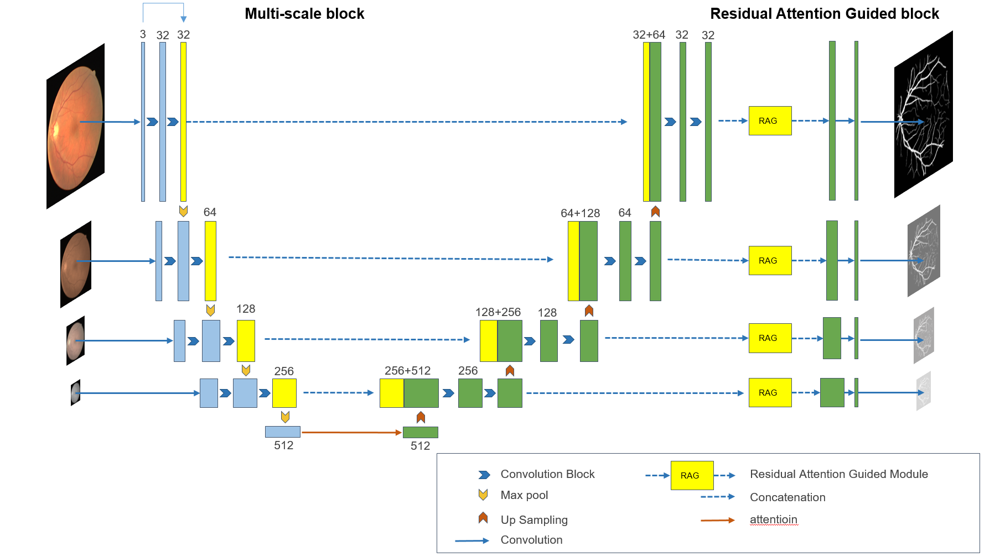
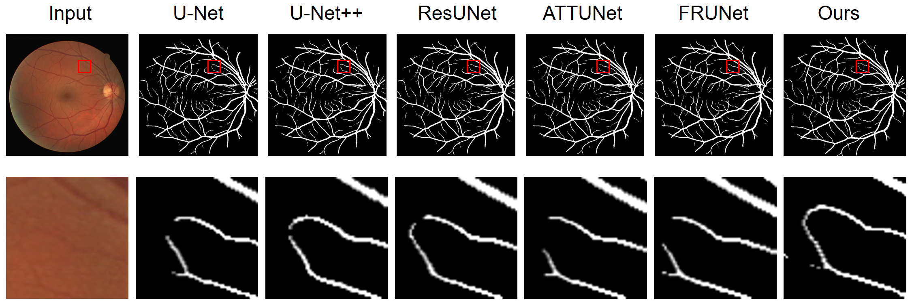

# MRAG-Net
MRAG-Net

# Multi-scale  Residual Attention Guided Network for Retinal Image Segmentation





## Environment

- CPU: Intel(R) Xeon(R) Gold 6130 CPU @ 2.10GHz
- GPU: Tesla P100-SXM2-16GB
- CUDA: 11.7
- Pytorch 1.13.0
- data：data(https://pan.baidu.com/s/1NvgOmqIHd7kzcTMGWB08Zw 提取码: r5va)


## ✅ Experimental Result

|Dataset|mIoU|F1 score|Acc|AUC|Sen|MCC
|---|---|---|---|---|---|---|
|DRIVE|0.8277|0.8195|0.9639|0.9855|0.8392|0.8009|
|STARE|0.8472|0.8368|0.9722|0.9827|0.8348|0.8223|


## 🚄 Train

If you have installed 'WandB', login your ID in command line.<br>
If not, fix <b>'wandb: false'</b> in <b>"configs/train.yml"</b>
You can login through your command line or <b>'wandb.login()'</b> inside <b>"main.py"</b>

For <b>Train</b>, edit the [<b>configs/train.yml</b>](configs/train.yml) and execute below command
```
bash bash_train.sh
```

---

## 🛴 Inference

For <b>Inference</b>, edit the [<b>configs/inference.yml</b>](configs/inference.yml) and execute below command. <br>
Please locate your model path via  <b>'model_path'</b> in <b>"configs/inference.yml"</b>
```
bash bash_inference.sh
```

- If you are using pretrained model, the result should be approximate to table's
